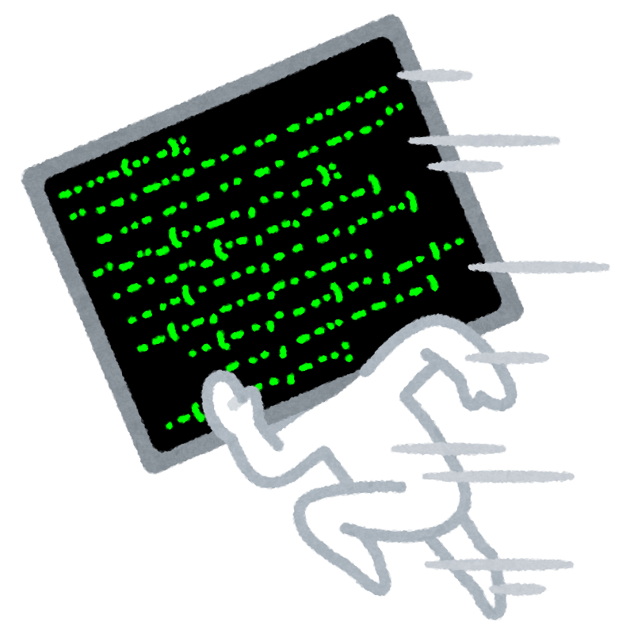
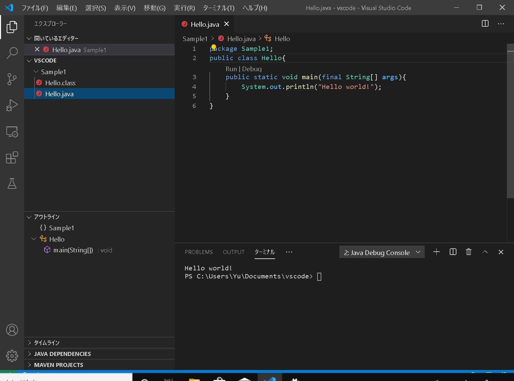

VSCode の使い方
===


---

## VSCode ってなんですか

* ソースコード編集ソフト(エディタ)
* 軽量, 高速, 多機能
    * デバッグ(実行してバグを検証)
    * 構文色分け
    * 自動補完 etc.
* 柔軟にカスタマイズできる
    * いろんな言語に対応可能
    * 見た目も変えられる


---
### 余談: エディタ戦争
* vi(1976~)とVim(1988~)
    * 挿入や選択などのモードを切替ながら操作
    * 標準搭載されることも多い
* Emacs(1972~)
    * Ctrlなどと組み合わせたショートカットで操作
    * 拡張性が非常に高い

どちらも
* 根強いファンが多く，~~争いが絶えない~~
* マウスの普及以前に開発: ショートカットが豊富
* いずれにせよ **VSCodeの方が学びやすい**


---

## VSCodeでプログラムを実行
すぐできる方法は3つくらいある
1) VSCodeのデバッグ機能を使う(もう試した)
1) 拡張機能(CodeRunner)を使う
1) ターミナルから実行する(原始的!)
**実のところ方法 1.も方法 2.も
方法 3.を自動化している**



---

## 方法3: ターミナルから実行


1) 「ターミナル」をクリック
1) 「新しいターミナル」を選択
1) ウィンドウ下部に表示されているターミナル画面をクリック
1) コマンド入力


---

## ターミナルの使い方

特定のフォルダにしかいられない: __今いるフォルダを意識してコマンド実行__

1) **dir** コマンド: 現在いるフォルダの内容を出力
1) **pwd** コマンド: 現在いるフォルダの絶対パスを出力
1) **cd** コマンド: 現在いるフォルダから指定したフォルダーに移動
1) **javac** コマンド: javaファイルのコンパイル
1) **java** コマンド: classファイルの実行(インタプリター)

他にもたくさんのコマンドがありますが，今日は特に下の二つ(4.と5.)に注目してください.

---
## 準備(前提)

次のようなソースコード(Sample1.java)があるものとします

```Java
package Sample1; 

public class Sample1
{
    public static void main(final String[] args)
    {
        System.out.println("Hello world!");
    }
}

```
現在いるフォルダはvscodePGとなっているとします
```C
vscodePG> // 現在いるフォルダ
```

---

## Javaファイルのコンパイル(1)

1行目に
```Java
package Sample1;
```
などが**ある**場合，dirと打ってSample1フォルダがあるかどうかを確かめます．
``` C
vscodePG> dir // 現在のフォルダにあるファイルとフォルダをすべて表示
```
以下を入力してコンパイルします．
```C
vscodePG> javac Sample1/Sample1.java　 // コンパイル
```
この後に，次のように入力して実行します．
```C
vscodePG> java Sample1/Sample1 // インタプリター実行
```

---

## Javaファイルのコンパイル(2)

1行目に
```Java
package Sample1;
```
などが**ない**場合，dirと打って.javaファイルがあるかどうかを確かめます．
``` C
vscodePG> dir // 現在のフォルダにあるファイルとフォルダをすべて表示
``` 
以下を入力してコンパイルします．
```C
vscodePG> javac Sample1.java　// コンパイル
```
この後に，次のように入力して実行します．
```C
vscodePG> java Sample1 // インタプリター実行
```

---
## 解説

* **javac** コマンドはコンパイラ
    * ソースコード(.java)をバイトコード(.class)に翻訳
    * バイトコードそのままでは実行できない
* **java** コマンドはインタプリター
    * バイトコードを読み取って仮想環境(JVM)で実行
    * 仮想環境はプラットフォーム(Win, Macなど)ごとに違う
    * JVMさえあればWinでもMacでも同じバイトコードが動く

---

## トラブルシューティング

1) **Q**. Sample1や.javaファイルが見つからない:

    **A**. cdコマンドでフォルダを移動しましょう

    ```C
    vscodePG> cd Sample1 // Sample1に移動
    Sample1> pwd // 現在のフォルダの上にあるフォルダを全て表示
    Sample1> cd .. // 一つ上のフォルダに移動
    vscodePG> // 戻ってくる
    ```

1) **Q**. .javaファイルがコンパイルできない

   **A**. エラ〜メッセージをググるとよいかもしれません

1) **Q**. 

   **A**. 管理者(先生)を呼んでください

